# Jarkom-Modul-1-2026-K-58
## Modul 1 - K-58

Nama Kelompok: K-58  
Mata Praktikum: Jaringan Komputer  
Modul: 1  
Platform: GNS3 Web, Docker Linux, Wireshark

## Soal 1 - Membangun Topologi Jaringan pada GNS3

### Tujuan

Pada soal ini dilakukan pembuatan topologi jaringan menggunakan GNS3 Web dengan beberapa node yang terdiri dari router, switch, dan client. Topologi digunakan sebagai dasar untuk pengujian komunikasi antar jaringan pada soal berikutnya.

### Topologi

Node yang digunakan:

| Node | Keterangan |
|---|---|
| Lain | Router utama |
| Switch1 | Menghubungkan Alice dan Mika |
| Switch2 | Menghubungkan Chisa |
| Switch3 | Menghubungkan Knights dan Eiri |

Pembagian subnet:

| Network | Interface Lain | Client |
|---|---|---|
| 192.240.1.0/24 | eth1 | Alice, Mika |
| 192.240.2.0/24 | eth2 | Chisa |
| 192.240.3.0/24 | eth3 | Knights, Eiri |


### Konfigurasi IP
1). Bikin topologi dulu
#### Output Topologi
terus di run.
2). Router Lain, kita tulis di terminal lain:

```bash
ip link set eth1 up
ip link set eth2 up
ip link set eth3 up

ip addr add 192.240.2.1/24 dev eth1
ip addr add 192.240.3.1/24 dev eth2
ip addr add 192.240.1.1/24 dev eth3

ip -br a
```

### Client:
kemudian di masing2 client setting ini
1). Alice :
```bash
ip addr add 192.240.1.2/24 dev eth0
ip route add default via 192.240.1.1
```
2). Mika
```bash
ip addr add 192.240.1.3/24 dev eth0
ip route add default via 192.240.1.1
```
3). Chisa:
```bash
ip addr add 192.240.2.2/24 dev eth0
ip route add default via 192.240.2.1
```
4). Knights:
```bash
ip addr add 192.240.3.2/24 dev eth0
ip route add default via 192.240.3.1
```
5). Eiri:
```bash
ip addr add 192.240.3.3/24 dev eth0
ip route add default via 192.240.3.1
```
### Penjelasan
Perintah **ip addr add** digunakan untuk memberikan alamat IP pada interface jaringan.
Perintah **ip route add** default via digunakan untuk menentukan gateway yang digunakan agar node dapat berkomunikasi dengan jaringan lain.
sehingga output yang didapatkan adalah seluruh node berhasil mendapatkan alamat IP sesuai subnet masing2.

### Output
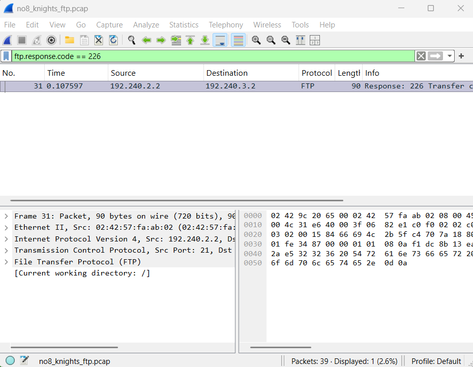
## Soal 2 - Konfigurasi Routing Antar Subnet
### Tujuan

Mengaktifkan kemampuan router Lain agar dapat meneruskan paket antar jaringan berbeda.

### Script Konfigurasi Router

**File:**
```bash
/root/router_config.sh
```

Isi script:
```bash
#!/bin/sh

echo 1 > /proc/sys/net/ipv4/ip_forward

sysctl -p


iptables -F
iptables -t nat -F


iptables -A FORWARD -i eth1 -j ACCEPT
iptables -A FORWARD -i eth2 -j ACCEPT
iptables -A FORWARD -i eth3 -j ACCEPT


iptables -t nat -A POSTROUTING -o eth0 -j MASQUERADE
```
### Penjelasan
1). Mengaktifkan IP Forwarding
```bash
echo 1 > /proc/sys/net/ipv4/ip_forward
```
Digunakan untuk mengaktifkan fungsi router agar dapat meneruskan paket.

2). Membaca konfigurasi kernel
```bash
sysctl -p
```
Digunakan untuk menerapkan konfigurasi sistem.

3). Menghapus aturan firewall lama
```bash
iptables -F
iptables -t nat -F
```
Digunakan agar konfigurasi firewall dimulai dari kondisi bersih.

4). Mengizinkan forwarding
```bash
iptables -A FORWARD -i eth1 -j ACCEPT
```
Memperbolehkan paket dari interface eth1 diteruskan.

#### Hal yang sama dilakukan untuk eth2 dan eth3.
NAT
```bash
iptables -t nat -A POSTROUTING -o eth0 -j MASQUERADE
```
Digunakan agar jaringan internal dapat mengakses jaringan luar.


**Pengujian:**
```bash
ping 192.240.3.2
```
dari client subnet berbeda.
**Hasil**
### Output Soal 2
Router berhasil melakukan routing antar subnet.
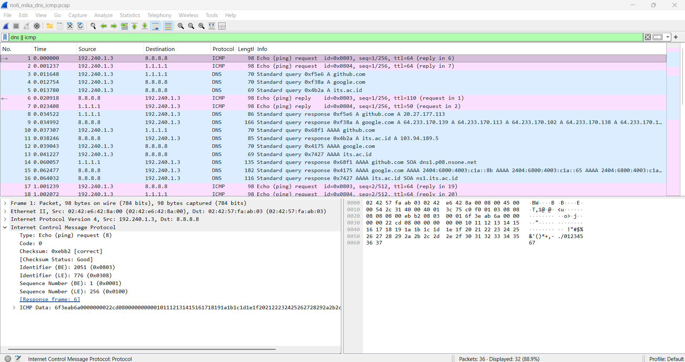

## Soal 3 - Konfigurasi DNS dan Internet Access
**Tujuan**
Melakukan konfigurasi DNS agar client dapat melakukan resolusi domain.

### Konfigurasi DNS
**File:**
```bash
/etc/resolv.conf
```
Isi:
```bash
nameserver 8.8.8.8
```
#### Pengujian
Command:
```bash
ping google.com 
```
atau
```bash
nslookup google.com
```
#### Penjelasan
**nameserver 8.8.8.8** menggunakan Google Public DNS sebagai server DNS.

Ketika melakukan ping terhadap domain, sistem akan melakukan DNS lookup terlebih dahulu untuk mendapatkan alamat IP tujuan.

**Output**

DNS berhasil melakukan resolusi domain.
contoh : google.com | Address : 64.xxx.xxx.xxx
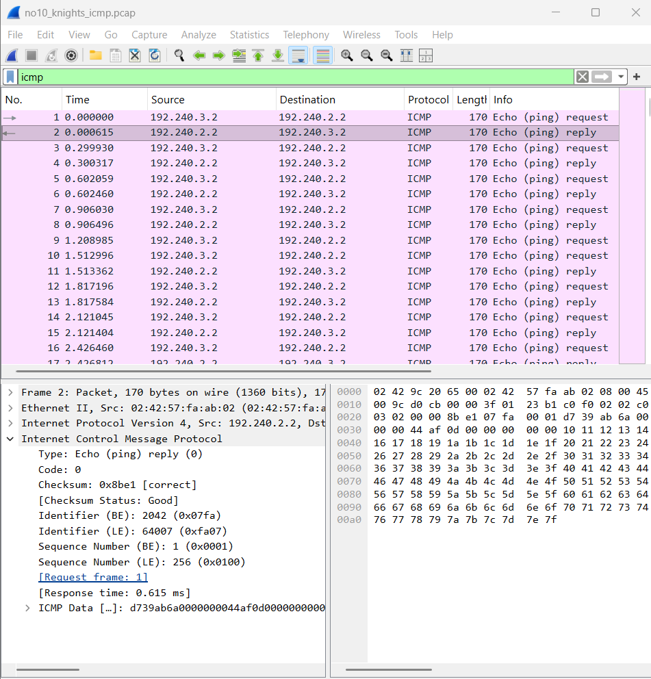

## Soal 4 - Membuat Script Monitoring Status Router
**Tujuan**
Membuat script untuk melihat status interface jaringan dan konfigurasi NAT.

#### **Script**
Di terminal Lain, jalankan satu-satu:
```bash
sysctl -w net.ipv4.ip_forward=1
```
lalu:
```bash
iptables -t nat -A POSTROUTING -o eth0 -j MASQUERADE
```
kemudian:
```bash
iptables -A FORWARD -i eth1 -o eth0 -j ACCEPT
iptables -A FORWARD -i eth2 -o eth0 -j ACCEPT
iptables -A FORWARD -i eth3 -o eth0 -j ACCEPT
iptables -A FORWARD -i eth0 -m conntrack --ctstate ESTABLISHED,RELATED -j ACCEPT
```
Setelah itu cek:
```bash
iptables -t nat -L -v -n
```
Kalau tidak ada error, buka console Alice dan tes:
```bash
ping -c 4 8.8.8.8
```
lalu
```bash
echo "nameserver 8.8.8.8" > /etc/resolv.conf
ping -c 4 google.com
```
#### Penjelasan
Penjelasan
1). Melihat interface
```bash
ip -br a
```
2). Menampilkan interface jaringan secara ringkas.
Melihat NAT
```bash
iptables -t nat -L
```
Menampilkan aturan NAT yang aktif.

3). Melihat forwarding
```bash
iptables -L FORWARD
```
#### Output
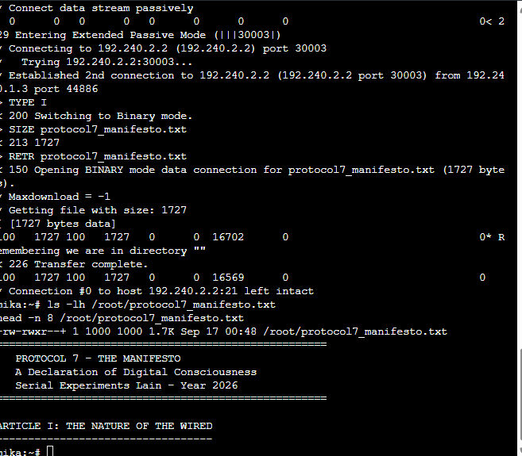

## Soal 5 - Membuat Konfigurasi Persisten Setelah Restart
**Tujuan**
Memastikan konfigurasi jaringan dan script tetap tersedia setelah node dilakukan restart.

**Backup Konfigurasi**
Konfigurasi disimpan dalam bentuk script pada directory:
```bash
/root
```
Contoh:
```bash
/root/cek_status.sh
/root/router_config.sh
```
### Script 
**1. Buat konfigurasi jaringan permanen di lain**
Ketik:
```bash
nano /etc/network/interfaces
```
isi menjadi :
```bash
auto lo
iface lo inet loopback

auto eth0
iface eth0 inet dhcp

auto eth1
iface eth1 inet static
    address 192.240.2.1
    netmask 255.255.255.0

auto eth2
iface eth2 inet static
    address 192.240.3.1
    netmask 255.255.255.0

auto eth3
iface eth3 inet static
    address 192.240.1.1
    netmask 255.255.255.0
```
simpan
**2. Buat IP Forwarding permanen**
```bash
nano /etc/sysctl.conf
net.ipv4.ip_forward=1
```
simpan lalu
```bash
sysctl -p
```
**3. Buat NAT otomatis setelah boot**
```bash
nano /etc/local.d/nat.start
```
isi :
```bash
#!/bin/sh
iptables -t nat -C POSTROUTING -o eth0 -j MASQUERADE 2>/dev/null || iptables -t nat -A POSTROUTING -o eth0 -j MASQUERADE
iptables -C FORWARD -i eth1 -o eth0 -j ACCEPT 2>/dev/null || iptables -A FORWARD -i eth1 -o eth0 -j ACCEPT
iptables -C FORWARD -i eth2 -o eth0 -j ACCEPT 2>/dev/null || iptables -A FORWARD -i eth2 -o eth0 -j ACCEPT
iptables -C FORWARD -i eth3 -o eth0 -j ACCEPT 2>/dev/null || iptables -A FORWARD -i eth3 -o eth0 -j ACCEPT
iptables -C FORWARD -i eth0 -m conntrack --ctstate ESTABLISHED,RELATED -j ACCEPT 2>/dev/null || iptables -A FORWARD -i eth0 -m conntrack --ctstate ESTABLISHED,RELATED -j ACCEPT
```
kemudian :
```bash
chmod +x /etc/local.d/nat.start
rc-update add local default
```
**4. Buat script yang diminta soal, isi di lain**
```bash
nano /root/cek_status.sh
```
isi:
```bash
#!/bin/sh
echo "=== INTERFACE STATUS ==="
ip -br a
echo
echo "=== NAT TABLE ==="
iptables -t nat -L -v -n
```
lalu
```bash
chmod +x /root/cek_status.sh
/root/cek_status.sh
```
### Output
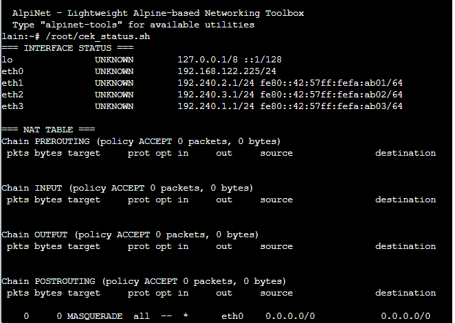
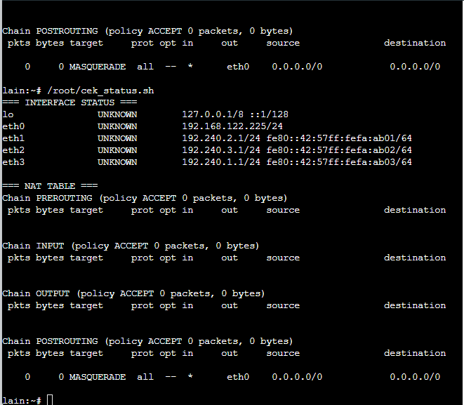
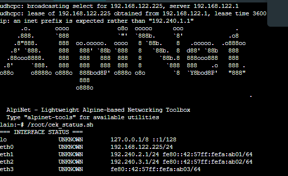

## Soal 6 - DNS Resolution dan ICMP Analysis Menggunakan Wireshark

### Tujuan

Melakukan pengujian proses resolusi DNS dan komunikasi menggunakan protokol ICMP. 
Capture paket dilakukan menggunakan Wireshark untuk melihat proses request dan response yang terjadi pada jaringan.

---

### Konfigurasi

Pada node Mika dilakukan pengujian koneksi terhadap beberapa domain.

Cara pengerjaan:
1). Buka node mika dan switch 1 lalu start capture. buka console mika, dan buka file yang dari soal di wireshark
2). di console mika
```bash
#!/bin/bash

echo "==========================================="
echo "  Protocol 7 Traffic Generator v2026"
echo "  Node: Mika Iwakura"
echo "==========================================="
echo "[*] Generating DNS & ICMP traffic..."

# ICMP Traffic
ping -c 5 8.8.8.8 &
ping -c 5 1.1.1.1 &
ping -c 3 its.ac.id &

# DNS Queries
nslookup google.com 8.8.8.8 &
nslookup its.ac.id 8.8.8.8 &
nslookup github.com 1.1.1.1 &
dig @8.8.8.8 example.com A &
dig @1.1.1.1 cloudflare.com AAAA &

wait
echo "[*] Traffic generation complete."
echo "[*] Check Wireshark for captured packets."
```
lalu disimpan
```bash
chmod +x traffic_protocol7.sh
./traffic_protocol7.sh
```
Filter wireshark
```bash
dns || icmp
```
harus memperlihatkan
- filter dns || icmp
- paket ICMP
- paket DNS (jika ada)
- Source
- Destination

### Output
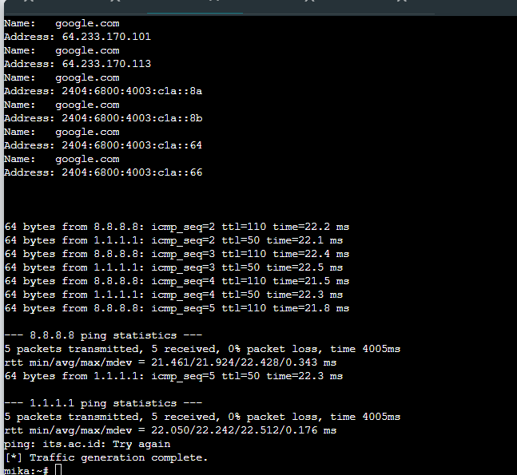

## Soal 7 - Konfigurasi Hak Akses File Linux
### Tujuan

Mengatur permission file pada Linux sehingga user tertentu memiliki hak akses sesuai kebutuhan.

### Script Konfigurasi
**Pembuatan file:**
```bash
touch /var/wired/data/signal_alice.txt
```
**Mengubah permission:**
```bash
chmod 644 /var/wired/data/signal_alice.txt
```
**Melihat permission:**
```bash
ls -l /var/wired/data
```
### Pengujian User

User Alice mencoba melakukan perubahan file.

Alice:
```bash
echo "Signal from Alice - K58" > /root/signal_alice.txt
```
upload sbg alice :
```bash
curl -v -u alice:alice123 \
-T /root/signal_alice.txt \
ftp://192.240.2.2/signal_alice.txt
```
cek di chisa-deb :
```bash
ls -l /var/wired/data/signal_alice.txt
cat /var/wired/data/signal_alice.txt
```
Berhasil karena Alice memiliki permission write.

User Eiri mencoba mengakses file.
coba di ping
```bash
curl -v -u eiri:eiri123 ftp://192.240.2.2/
```
Hasil:
```bash
Permission denied
```
karena user tidak memiliki hak akses write

### Output
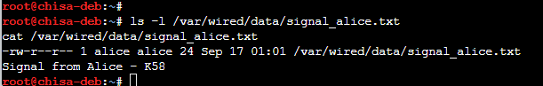

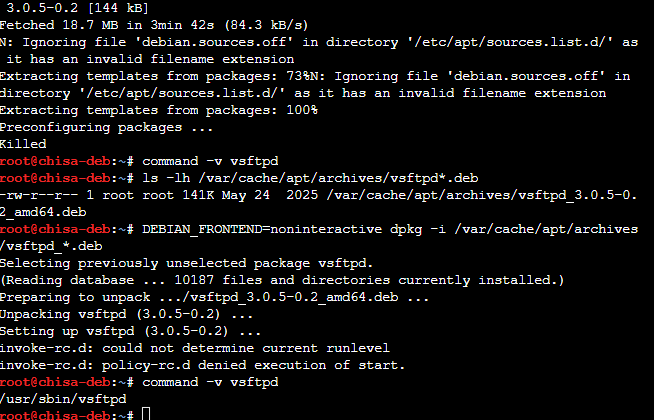
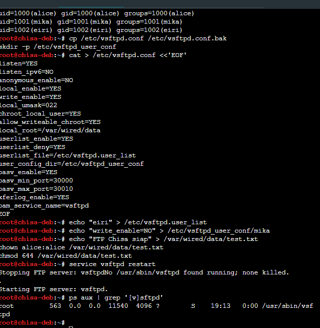
## Soal 8 - Konfigurasi FTP Server dan Transfer File
**Tujuan**

Melakukan konfigurasi FTP server menggunakan vsftpd serta melakukan transfer file antara client Mika dan server Knights.

Konfigurasi FTP Server
Install vsftpd

Command:
```bash
apt install vsftpd
Konfigurasi vsftpd
```
File:
```bash
/etc/vsftpd.conf
```
Isi konfigurasi:
```bash
listen=YES
anonymous_enable=NO
local_enable=YES
write_enable=YES

local_umask=022

chroot_local_user=YES

allow_writeable_chroot=YES

pasv_enable=YES
pasv_min_port=30000
pasv_max_port=30010
```
### Restart Service

**Command:**
```bash
service vsftpd restart
```

### Upload File FTP

Dari node Mika:
```bash
curl -v \
-u alice:alice123 \
-T knights_status_report.txt \
ftp://192.240.2.2/
```
### script 
ketik di console knights
```bash
cat > /root/knights_status_report.txt <<'EOF'
====================================================
   KNIGHTS OF THE EASTERN CALCULUS - STATUS REPORT
   Protocol 7 Surveillance Network
   Classification: LEVEL 7 - EYES ONLY
====================================================

Date: [CLASSIFIED]
Agent: Knights Unit Alpha
Node: Switch 3 - Subnet 192.240.3.0/24

---

SUBJECT: Network Reconnaissance Report

The Wired has been successfully infiltrated through
Protocol 7 channels. Current observations:

1. Router "Lain" has been identified as the central
   gateway node connecting all three subnet segments.

2. Switch 1 (192.240.1.0/24) hosts Alice and Mika.
   Both nodes show standard traffic patterns.

3. Switch 2 (192.240.2.0/24) hosts Chisa alone.
   Isolated subnet - minimal cross-traffic observed.

4. Switch 3 (192.240.3.0/24) - our operational base.
   Knights and Eiri coexist on this segment.

RECOMMENDATION:
Continue monitoring FTP and Telnet sessions for
plaintext credential exposure. SSH tunnels remain
impenetrable without keylog access.

--- END OF REPORT ---
Knights of the Eastern Calculus
"Let's all love Lain."
EOF
```
Blacklist Eiri + buat Mika read-only:
```bash
Blacklist Eiri + buat Mika read-only:
```
nyalakan FTP
```bash
pkill vsftpd 2>/dev/null
/usr/sbin/vsftpd /etc/vsftpd.conf &
sleep 1
ps aux | grep '[v]sftpd'
```
di console knights :
```bash
pkill vsftpd 2>/dev/null
/usr/sbin/vsftpd /etc/vsftpd.conf &
sleep 1
ps aux | grep '[v]sftpd'
```
di console chisa :
```bash
curl -v --disable-epsv -u alice:alice123 \
-T /root/knights_status_report.txt \
ftp://192.240.2.2/knights_status_report.txt
```
### Wireshark Analysis
1). buka file **no8_knights_ftp.pcap** lalu filter 
```bash
ftp || ftp-data
```
Setelah itu cari paket yang info-nya mengandung:
- PASV
- 227 Entering Passive Mode
- STOR knights_status_report.txt
- 226 Transfer complete
filter
```bash
ftp.request.command == "PASV"
ftp.request.command == "PASV"
ftp.response.code == 226
```
(diketik satu2)

Packet yang terlihat:

- FTP Request PASV
- FTP Request STOR
- FTP Response 226 Transfer Complete
### Output
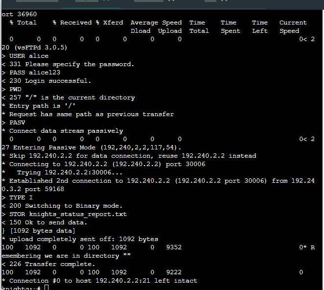
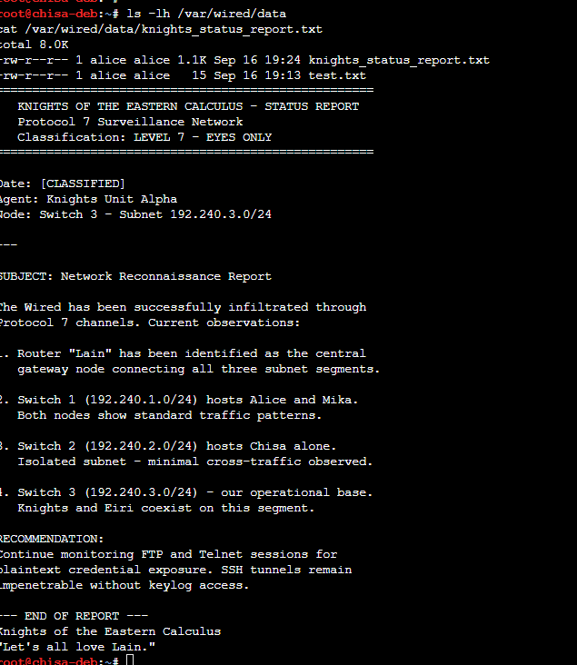
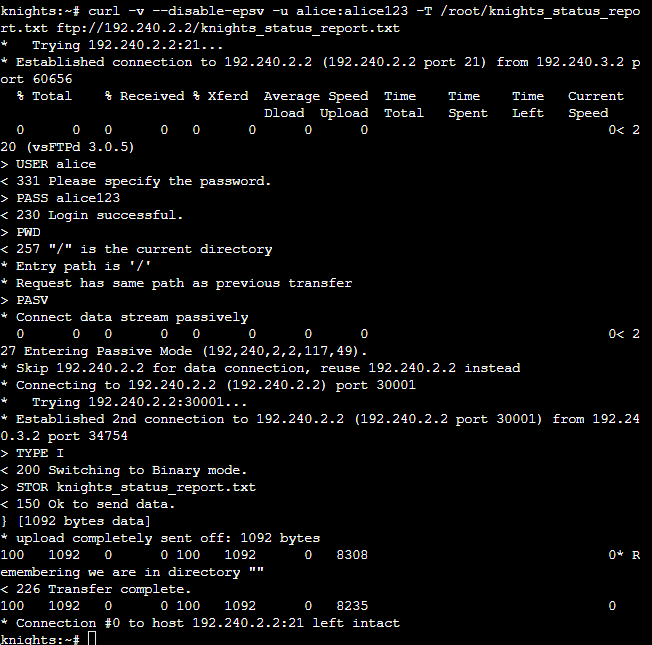

## Soal 9 - Analisis Telnet Menggunakan Wireshark
**Tujuan**

Melakukan analisis keamanan protokol Telnet dengan melihat bahwa data komunikasi dapat terbaca dalam bentuk plaintext.

### Konfigurasi
unduh file nomor 9 di console mika
```bash
ping -c 2 192.240.2.2
```
lalu di **chisa-deb** buat file nya
```bash
cat > /var/wired/data/protocol7_manifesto.txt <<'EOF'
====================================================
   PROTOCOL 7 - THE MANIFESTO
   A Declaration of Digital Consciousness
   Serial Experiments Lain - Year 2026
====================================================

ARTICLE I: THE NATURE OF THE WIRED
----------------------------------
The Wired is not merely a network of interconnected
machines. It is the collective unconscious of
humanity, rendered in packets and protocols.

Every TCP handshake is a conversation.
Every DNS query is a question.
Every encrypted tunnel is a whispered secret.

ARTICLE II: THE SEVEN PRINCIPLES
--------------------------------
1. All nodes are equal in the eyes of the router.
2. No packet shall be dropped without cause.
3. Encryption is the right of every connection.
4. Plaintext protocols expose the vulnerable.
5. The firewall protects, but also imprisons.
6. NAT masquerade hides truth behind a single face.
7. The Wired remembers everything - packet loss
   is merely a temporary forgetting.

ARTICLE III: THE PROPHECY OF LAIN
---------------------------------
"If you're not remembered, then you never existed."

In the world of networking, persistence is survival.
A configuration that vanishes upon restart is a
thought that was never truly committed to memory.

Therefore: Save your iptables. Write your interfaces.
Let your routing tables endure beyond the power cycle.

ARTICLE IV: CONCERNING SECURITY
--------------------------------
Telnet is the glass house of protocols - transparent
to any observer with a packet sniffer.

SSH is the steel vault - its contents visible only
to those who possess the key.

Choose wisely which door you open to The Wired.

---
"No matter where you go, everyone's connected."
- Lain Iwakura
EOF
```
lalu
```bash
chown alice:alice /var/wired/data/protocol7_manifesto.txt
chmod 644 /var/wired/data/protocol7_manifesto.txt
ls -lh /var/wired/data/protocol7_manifesto.txt
```
nyalakan/run mika, lalu ketik ini di console nya:
```bash
ip -br a
ping -c 2 192.240.1.1
ping -c 2 192.240.2.2
command -v curl
```
Setelah itu, masih di Mika, buat file baru untuk membuktikan bahwa Mika tidak punya hak write:
```bash
echo "Mika mencoba upload" > /root/mika_upload_test.txt
```
Lalu coba upload:
```bash
curl -v -u mika:mika123 \
-T /root/mika_upload_test.txt \
ftp://192.240.2.2/mika_upload_test.txt
```
Karena akun Mika sudah kita konfigurasi read-only, targetnya harus ada respons seperti:
```bash
550 Permission denied
```
### Output
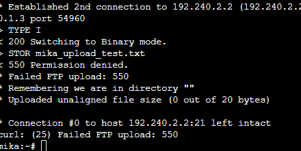
## Soal 10 - ICMP Capture Knights
### Tujuan
Melakukan capture komunikasi ICMP antara node Knights dengan node tujuan.

### Command
Pada Knights:
```bash
ping 192.240.2.2
```
lalu start capture, dan kembali ke knights dan jalankan command 
```bash
ping -c 77 -s 128 -i 0.3 192.240.2.2
```
lalu stop capture, dan download capture tsb
Buka **no10_knights_icmp.pcap** di Wireshark dan pakai filter:
```bash
icmap
```
### Hasil

Capture Wireshark menunjukkan:

|Paket|Fungsi|
|Echo Request|	Paket permintaan dari pengirim|
|Echo Reply|	Balasan dari penerima|
### Output
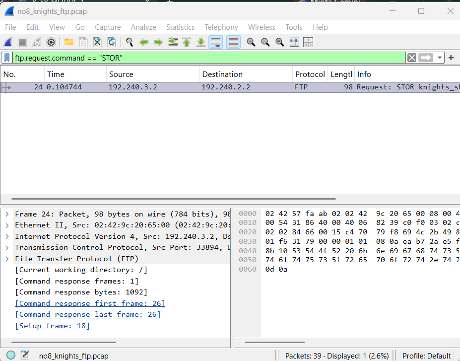

## Soal 11 - Analisis Telnet Capture Alice
**Tujuan**

Melakukan capture sesi Telnet dari node Alice dan melihat informasi paket yang dikirimkan.

### pengerjaan
Buka console chisa-deb dulu dan jalankan cuma ini:
```bash
command -v telnetd
command -v in.telnetd
```
harus mengeluarkan **/usr/sbin/telnetd**

Di chisa deb bikin akun yg diminta soal 
```bash
id phantom_user >/dev/null 2>&1 || useradd -m -s /bin/bash phantom_user
echo 'phantom_user:wired_ghost' | chpasswd
```
lalu cek
```bash
grep -v '^#' /etc/inetd.conf | grep telnet
```
Setelah itu nyalakan inetd:
```bash
pkill inetutils-inetd 2>/dev/null
/usr/sbin/inetutils-inetd
```
Lalu cek port 23:
```bash
ss -ltnp | grep ':23'
```
setelah itu capture di link eiri dan switch3, lalu di console eiri login menggunakan unsername: **phantom_user** dan password: **wired_ghost**:
```bash
telnet 192.240.2.2
```
lalu ketik **whoami** dan **exit**
setelah itu dimatikan capturenya dan di download, lalu buka **wireshark**
filter menggunakan:
```bash
telnet
```
Klik salah satu paket TELNET dulu (misalnya baris No. 34 yang biru sekarang sudah oke).
Klik menu atas:
```bash
Analyze
  ↓
Follow
  ↓
TCP Stream
```
Nanti muncul isi percakapan Telnet. Cari **Follow** dan pilih **TCP Stream**

### Output
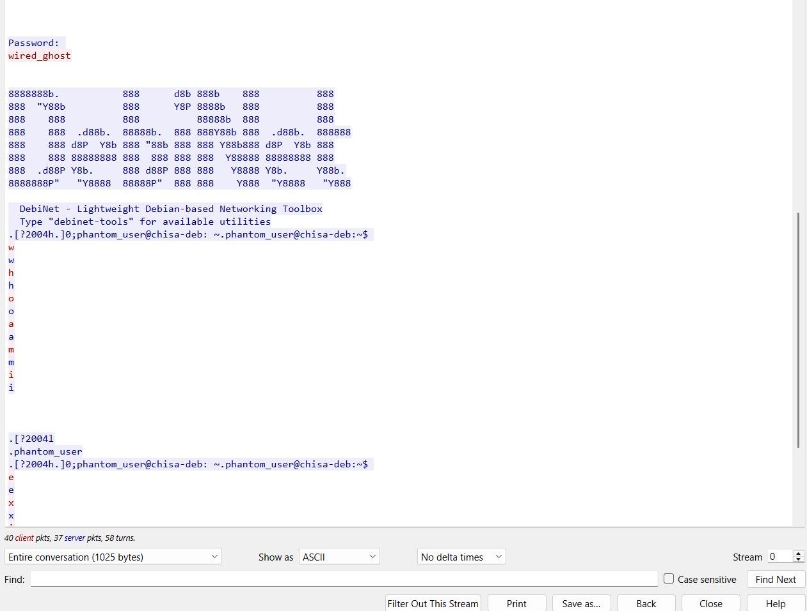

Kalau ada LISTEN di port 23, berarti Telnet server Chisa sudah hidup ✅.

## Soal 14 — Brute Force Analysis

**Tujuan:** menganalisis `wired_bruteforce.pcapng` untuk menemukan IP penyerang, IP dan port target, password `lain_admin` yang berhasil ditembus, serta *web server software* beserta versinya.

### Langkah Analisis

1. Buka `wired_bruteforce.pcapng` di Wireshark. Capture berisi **351 paket** dengan banyak percobaan login.
2. Isolasi sesi HTTP yang berisi login berhasil dengan display filter:
   ```
   tcp.stream eq 59
   ```
3. Klik kanan pada paket HTTP lalu pilih **Follow → HTTP Stream** untuk membaca *request* dan *response* utuh.


*Gambar 14.1 — Stream 59 (5 paket dari 351) dan Follow HTTP Stream yang menampilkan kredensial.*

### Temuan

Alur paket pada stream 59 (frame 347–351):

| Frame | Arah | Info |
|:---:|---|---|
| 347 | `172.26.7.50` → `172.26.7.100` | TCP `49203 → 8080` **[SYN]** |
| 348 | `172.26.7.100` → `172.26.7.50` | TCP `8080 → 49203` **[SYN, ACK]** |
| 349 | `172.26.7.50` → `172.26.7.100` | TCP **[ACK]** |
| 350 | `172.26.7.50` → `172.26.7.100` | HTTP `POST /login.php HTTP/1.1` (`application/x-www-form-urlencoded`) |
| 351 | `172.26.7.100` → `172.26.7.50` | HTTP `200 OK` (`text/html`) |

Isi *request* (dari Follow HTTP Stream):

```http
POST /login.php HTTP/1.1
Host: 172.26.7.100:8080
User-Agent: Fuzz Faster U Fool v2.1.0-dev
Content-Type: application/x-www-form-urlencoded
Content-Length: 45

username=lain_admin&password=wired_pr0tocol_7
```

Isi *response*:

```http
HTTP/1.1 200 OK
Server: Apache/2.4.62
Content-Type: text/html; charset=UTF-8
Content-Length: 35
X-Powered-By: PHP/8.3.14

<h1>Success! Login successful.</h1>
```

| Pertanyaan | Jawaban | Bukti |
|---|---|---|
| IP penyerang | **`172.26.7.50`** | Pengirim `SYN` dan `POST /login.php` |
| Target IP:port | **`172.26.7.100:8080`** | Header `Host` dan tujuan paket `POST` |
| Password `lain_admin` | **`wired_pr0tocol_7`** | Body `POST`, respons `200 OK` berisi "Login successful" |
| Web server & versi | **`Apache/2.4.62`** | Header `Server` pada respons |

### Analisis

- **User-Agent `Fuzz Faster U Fool v2.1.0-dev`** adalah *user agent* bawaan tool *fuzzing* **ffuf**. Ini indikasi kuat bahwa login dilakukan secara otomatis, bukan oleh pengguna biasa.
- Seluruh paket pada stream ini tercatat dalam rentang waktu sekitar **1 ms** (`0.060517 s` sampai `0.061507 s`), sesuai dengan kecepatan serangan otomatis.
- `Content-Length: 45` sesuai dengan panjang body `username=lain_admin&password=wired_pr0tocol_7` (45 karakter).
- Kredensial terbaca **plain text** karena login berjalan di atas HTTP tanpa enkripsi.
- Server membocorkan versi perangkat lunaknya lewat header `Server` dan `X-Powered-By` (Apache 2.4.62, PHP 8.3.14). Informasi ini memudahkan penyerang mencari celah yang spesifik.
- **Mitigasi:** *rate limiting*, *account lockout*, CAPTCHA, MFA, `fail2ban`, HTTPS, dan menyembunyikan versi server (`ServerTokens Prod`, `expose_php = Off`).

### Validasi

```bash
nc 10.4.89.250 3401
```


*Gambar 14.2 — Semua jawaban benar dan flag diterima.*

**Flag:** `KOMJAR26{W1r3d_Brut3_TkFuZE8pqxgo36r4cVTTDIFW7}`

---
## Soal 15 — USB Keystroke Decoding

**Tujuan:** menganalisis `wired_usb_hid.pcap` untuk menemukan Vendor ID, Product ID, alamat *device* USB, dan pesan rahasia dari *keystroke* keyboard.

### Langkah Analisis

1. Buka `wired_usb_hid.pcap` di Wireshark. Awal capture berisi proses **enumerasi USB**: `GET DESCRIPTOR` (DEVICE dan CONFIGURATION) lalu `SET CONFIGURATION` (frame 1–8). Setelah itu terdapat paket data HID yang ditampilkan Wireshark sebagai `Unknown type 7f`.
2. Pilih **frame 2** (`GET DESCRIPTOR Response DEVICE`) dan buka *USB Device Descriptor* pada *packet details* untuk membaca `idVendor` dan `idProduct`.
3. Periksa field `usb.device_address` untuk mengetahui alamat *device* yang ditetapkan pada keyboard.
4. Karena paket data keystroke tidak didekode otomatis oleh Wireshark, isi laporan HID didekode dengan script Python `parse_usb.py`.


*Gambar 15.1 — USB Device Descriptor pada frame 2: `idVendor` dan `idProduct`.*

### Temuan Device Descriptor

| Field | Nilai |
|---|---|
| `bcdUSB` | `0x0110` (USB 1.1) |
| `bDeviceClass` | `0x00` (ditentukan pada Interface Descriptor) |
| `bMaxPacketSize0` | `8` |
| `idVendor` | **Logitech, Inc. (`0x046d`)** |
| `idProduct` | **Keyboard K120 (`0xc31c`)** |
| `bcdDevice` | `0x0100` |
| `bNumConfigurations` | `1` |

Verifikasi lewat *hex dump*: USB memakai **little-endian**, sehingga byte `6d 04` dibaca `0x046d` (Vendor ID) dan `1c c3` dibaca `0xc31c` (Product ID).

```
... 12 01 10 01 00 00 00 08 6d 04 1c c3 00 01 01 02 00 01
                            └─VID─┘ └─PID─┘
```

### Dekode Keystroke

Keyboard USB HID (*boot protocol*) mengirim laporan sebesar **8 byte** per penekanan tombol:

| Byte | Isi |
|:---:|---|
| 0 | *Modifier* (mis. `0x02` = Left Shift, `0x20` = Right Shift) |
| 1 | *Reserved* |
| 2–7 | *Keycode* tombol yang ditekan |

Pemetaan yang relevan: `a`–`z` = `0x04`–`0x1d`, `1`–`9` = `0x1e`–`0x26`, `0` = `0x27`, `-` = `0x2d`. Bila *modifier* Shift aktif, huruf menjadi kapital dan `-` menjadi `_`.

Logika inti dekode:

```python
LOWER = {**{0x04 + i: chr(ord('a') + i) for i in range(26)},
         **{0x1e + i: str(i + 1) for i in range(9)},
         0x27: '0', 0x2d: '-'}
UPPER = {**{0x04 + i: chr(ord('A') + i) for i in range(26)},
         0x2d: '_'}

def decode(reports):                      # reports: list of 8-byte HID reports
    out = []
    for r in reports:
        modifier, key = r[0], r[2]
        if key == 0:                      # key release / laporan kosong
            continue
        table = UPPER if modifier & 0x22 else LOWER
        out.append(table.get(key, LOWER.get(key, '?')))
    return ''.join(out)
```


*Gambar 15.2 — Output `parse_usb.py`.*

### Temuan

| Pertanyaan | Jawaban |
|---|---|
| Vendor ID | **`0x046d`** (Logitech, Inc.) |
| Product ID | **`0xc31c`** (Keyboard K120) |
| Alamat device USB | **`7`** |
| Pesan rahasia | **`Wired_Protocol_7_is_alive_2026`** |

### Analisis

- Pada frame enumerasi awal, kolom Source/Destination masih menampilkan `1794.0.0` (format `bus.device.endpoint`), yaitu *device* pada alamat default `0` sebelum diberi alamat. Alamat **7** adalah alamat yang ditetapkan pada keyboard tersebut.
- Keyboard USB tidak mengirim karakter ASCII, melainkan **keycode HID**. Karena itu diperlukan proses dekode: keycode → karakter, dengan *modifier* Shift menentukan kapital dan simbol.
- Pesan `Wired_Protocol_7_is_alive_2026` mengandung huruf kapital (`W`, `P`) dan underscore, yang keduanya memerlukan Shift. Ini menjelaskan mengapa byte *modifier* harus ikut diproses.
- Contoh ini menunjukkan risiko **USB HID injection / keylogger hardware**: perangkat yang tampak seperti keyboard biasa dapat merekam atau menyuntik input tanpa terdeteksi antivirus.

### Validasi

```bash
nc 10.4.89.250 3402
```


*Gambar 15.3 — Semua jawaban benar dan flag diterima.*

**Flag:** `KOMJAR26{USB_K3ystr0k3_w90lw7mTJn3iSliBm8Cn876tK}`

---
## Soal 16 — FTP Credential Theft

**Tujuan:** menganalisis `wired_ftp_theft.pcapng` untuk menemukan IP server FTP penyerang, *banner* FTP, kredensial login penyerang, dan ukuran file `knights_payload.exe`.

### Langkah Analisis

1. Buka `wired_ftp_theft.pcapng` (**111 paket**). Capture memuat beberapa sesi FTP, termasuk sesi pengecoh.
2. Petakan seluruh sesi FTP dengan menampilkan *banner* server dan *username* yang dikirim klien:
   ```
   ftp.request.command == "USER" || ftp.response.code == 220
   ```
   Filter ini menyisakan 8 paket (7,2%).
3. Pilih sesi yang mengunduh `knights_payload.exe`, lalu gunakan **Follow → TCP Stream** untuk membaca perintah `USER`, `PASS`, dan `RETR` serta respons server.


*Gambar 16.1 — Empat sesi FTP yang teridentifikasi dari filter `USER` / respons `220`.*

### Peta Sesi FTP

| Frame | Server | Banner (respons `220`) | Klien | `USER` |
|:---:|---|---|---|---|
| 4 / 6 | `10.7.3.60` | `InternalFileServer FTP ready` | `10.7.3.20` | `alice` |
| 18 / 22 | `10.7.3.60` | `InternalFileServer FTP ready` | `10.7.3.30` | `mika` |
| 42 / 48 | `198.51.100.7` | `wired-drop FTP server` | `10.7.3.40` | `guest` |
| 64 / 66 | `198.51.100.7` | `Welcome to Wired FTP Server (vsftpd 3.0.5)` | `10.7.3.50` | `knights_agent` |

Sesi `alice` dan `mika` berlangsung antara klien internal dan `InternalFileServer` (lalu lintas normal). Dua sesi lainnya terhubung ke IP publik `198.51.100.7`, yaitu server di luar jaringan internal `10.7.3.0/24`. Sesi `guest` hanya berupa login tanpa aktivitas malware, sedangkan sesi **`knights_agent`** adalah sesi yang mengunduh `knights_payload.exe`.

### Temuan

| Pertanyaan | Jawaban |
|---|---|
| IP server FTP penyerang | **`198.51.100.7`** |
| Banner software FTP | **`vsftpd 3.0.5`** (dari `220 Welcome to Wired FTP Server (vsftpd 3.0.5)`) |
| Kredensial penyerang | **`knights_agent:N4v1_s3cur3_2026`** |
| Ukuran `knights_payload.exe` | **`524288`** bytes (512 KiB) |

### Analisis

- FTP mengirim perintah dan kredensial dalam **teks biasa**. Contoh pada *hex dump* frame 6: `55 53 45 52 20 61 6c 69 63 65 0d 0a` = `USER alice\r\n`.
- *Banner* `220` yang dikirim otomatis saat koneksi dibuka membocorkan nama dan versi software server (`vsftpd 3.0.5`).
- Ukuran file `524288` bytes = 2¹⁹ = 512 KiB, ukuran yang lazim untuk file uji berukuran tetap.
- Dua sesi berbeda berasal dari IP server yang sama (`198.51.100.7`) dengan *banner* berbeda. Jawaban yang dipilih harus mengikuti sesi penyerang (`knights_agent`), bukan sesi `guest`.
- **Mitigasi:** ganti FTP dengan **SFTP/FTPS**, sembunyikan *banner* (`ftpd_banner` pada vsftpd), dan batasi koneksi keluar ke IP publik yang tidak dikenal.

### Validasi

```bash
nc 10.4.89.250 3403
```


*Gambar 16.2 — Semua jawaban benar dan flag diterima.*

**Flag:** `KOMJAR26{FTP_Th3ft_WW54JivFvObxTyi5MckEspNC6}`

---

## Soal 17 — HTTP Malware Retrieval

**Tujuan:** menganalisis `wired_http_c2.pcapng` untuk menemukan domain (Host) sumber malware, IP server penyerang, nama file executable yang diunduh, dan kode status HTTP.

### Langkah Analisis

1. Buka `wired_http_c2.pcapng` (**31 paket**).
2. Isolasi sesi unduhan dengan filter:
   ```
   tcp.stream eq 4
   ```
3. Buka **Follow → HTTP Stream** dan periksa header pada *packet details* (*Hypertext Transfer Protocol*).


*Gambar 17.1 — Stream 4 (5 paket dari 31) dan Follow HTTP Stream yang menampilkan unduhan `navi_agent.exe`.*

### Temuan

Alur paket pada stream 4:

| Frame | Arah | Info |
|:---:|---|---|
| 27 | `10.7.1.50` → `203.0.113.42` | TCP `51234 → 80` **[SYN]** |
| 28 | `203.0.113.42` → `10.7.1.50` | TCP **[SYN, ACK]** |
| 29 | `10.7.1.50` → `203.0.113.42` | TCP **[ACK]** |
| 30 | `10.7.1.50` → `203.0.113.42` | HTTP `GET /navi_agent.exe HTTP/1.1` |
| 31 | `203.0.113.42` → `10.7.1.50` | HTTP `200 OK` |

Request dan response:

```http
GET /navi_agent.exe HTTP/1.1
Host: wired-update.net
User-Agent: Mozilla/5.0 (Windows NT 10.0; Win64; x64)
Accept: */*
Connection: keep-alive

HTTP/1.1 200 OK
Server: nginx/1.24.0
Content-Type: application/octet-stream
Content-Length: 396
Content-Disposition: attachment; filename="navi_agent.exe"
```

Wireshark juga menampilkan *Full request URI*: `http://wired-update.net/navi_agent.exe`.

| Pertanyaan | Jawaban | Bukti |
|---|---|---|
| Domain (Host) | **`wired-update.net`** | Header `Host` pada request |
| IP server penyerang | **`203.0.113.42`** | Tujuan `GET` dan pengirim respons `200 OK` |
| Nama file executable | **`navi_agent.exe`** | URI request dan `Content-Disposition` |
| Kode status HTTP | **`200`** | Frame 31: `HTTP/1.1 200 OK` |

### Analisis

- Body respons diawali byte **`MZ`** (`4D 5A`), yaitu *magic number* file **PE (Windows executable)**, dan berisi *DOS stub* ("This program cannot be run in DOS mode"). Ini memastikan file yang diunduh benar-benar executable.
- `Content-Type: application/octet-stream` dan `Content-Disposition: attachment` membuat file diperlakukan sebagai unduhan biner.
- Domain `wired-update.net` menyamar sebagai layanan *update* yang sah, teknik umum untuk mengelabui korban maupun filter jaringan.
- Klien `10.7.1.50` adalah **korban** (pengunduh), sedangkan `203.0.113.42` adalah **server penyerang** (penyedia malware). Jangan tertukar antara kedua IP ini.
- **Mitigasi:** *web/DNS filtering*, blokir unduhan `.exe` dari domain tak dikenal, dan gunakan HTTPS dengan inspeksi TLS pada gateway.

### Validasi

```bash
nc 10.4.89.250 3404
```


*Gambar 17.2 — Flag diterima.*

**Flag:** `KOMJAR26{Navi_C2_D0wnl04d_Z0W4o3x8QMppUX7Fn16BlTYap}`

---

## Soal 18 — SMB Lateral Transfer

**Tujuan:** menganalisis `wired_smb_transfer.pcapng` untuk menemukan protokol yang dieksploitasi, IP pengirim dan penerima, folder tujuan malware, dan nama file malware.

### Langkah Analisis

1. Buka `wired_smb_transfer.pcapng` (**27 paket**) tanpa filter, karena seluruh trafik adalah satu sesi SMB.
2. Amati urutan paket dari *handshake* TCP hingga pertukaran pesan SMB2.
3. Periksa pesan `Tree Connect Request` untuk mengetahui *share* tujuan, lalu paket SMB2 setelahnya untuk nama file yang ditulis.


*Gambar 18.1 — Urutan sesi SMB2 dari `10.7.3.100` ke `10.7.1.50`.*

### Alur Sesi (frame 1–12)

| Frame | Arah | Info |
|:---:|---|---|
| 1–3 | `10.7.3.100` ⇄ `10.7.1.50` | TCP handshake ke port **445** (`49152 → 445`) |
| 4 | `10.7.3.100` → `10.7.1.50` | SMB2 **Negotiate Protocol Request** |
| 6 | `10.7.1.50` → `10.7.3.100` | SMB2 **Negotiate Protocol Response** |
| 8 | `10.7.3.100` → `10.7.1.50` | SMB2 **Session Setup Request** |
| 10 | `10.7.1.50` → `10.7.3.100` | SMB2 **Session Setup Response** |
| 12 | `10.7.3.100` → `10.7.1.50` | SMB2 **Tree Connect Request**, Tree: `\\10.7.1.50\ADMIN$` |

### Temuan

| Pertanyaan | Jawaban |
|---|---|
| Protokol file sharing | **`SMB2`** |
| IP pengirim (sumber malware) | **`10.7.3.100`** |
| IP penerima (korban) | **`10.7.1.50`** |
| Share/folder tujuan | **`ADMIN$`** |
| Nama file malware | **`wired_trojan_payload.exe`** |

### Analisis

- **SMB2** berjalan langsung di atas TCP **port 445**. Sebelum transfer, pengirim harus melewati tahap *negotiate*, *session setup* (autentikasi), lalu *tree connect* ke share.
- **`ADMIN$`** adalah *hidden administrative share* Windows yang memetakan ke direktori sistem (`C:\Windows`). Share ini hanya dapat diakses akun administrator, sehingga menulis file ke sana menandakan penyerang sudah memiliki kredensial admin.
- Pola "salin file ke `ADMIN$` lalu jalankan" merupakan teknik klasik ***lateral movement*** (mirip cara kerja PsExec), yaitu penyerang berpindah dari satu host ke host lain di dalam jaringan.
- **Mitigasi:** batasi akses port 445 antar-segmen dengan firewall, nonaktifkan admin share bila tidak diperlukan, terapkan prinsip *least privilege*, dan pantau penulisan file `.exe` ke `ADMIN$`.

### Validasi

```bash
nc 10.4.89.250 3405
```


*Gambar 18.2 — Semua jawaban benar dan flag diterima.*

**Flag:** `KOMJAR26{SMB_Tr4nsf3r_oyiFYdDiXqUSVjzDLLDNPz8XI}`

---

## Soal 19 — SMTP Threat Inspection

**Tujuan:** menganalisis `wired_smtp_threat.pcapng` pada stream TCP terkait untuk menemukan email korban, password yang diklaim bocor, jenis malware, batas waktu pembayaran, dan `MailClientID`.

### Langkah Analisis

1. Buka `wired_smtp_threat.pcapng` dan cari sesi SMTP yang berisi email ancaman.
2. Pada stream tersebut (`tcp.stream eq 6`), pilih **Follow → TCP Stream**. Stream berisi 6 paket klien dan 7 paket server (12 *turns*, 1101 bytes).
3. Baca perintah `DATA`, respons `354`, header email, dan body pesan.


*Gambar 19.1 — Kiri: Follow TCP Stream berisi email pemerasan. Kanan: validasi ke socket server port 3406.*

### Header Email

| Header | Nilai |
|---|---|
| `From` | `attacker@darkwired.net` |
| `To` | `victim@protocol7.co.jp` |
| `Subject` | `URGENT: Your Wired account has been compromised` |
| `Date` | `Thu, 10 Sep 2026 09:00:00 +0700` |
| `Content-Type` | `text/plain; charset=UTF-8` |

### Temuan

Isi pesan menyebutkan: password `pr0tocol_7_user`, komputer terinfeksi "*private ransomware*", permintaan **2 BTC**, batas waktu **72 jam (3 hari)**, dan baris penutup `MailClientID: 7719980706`.

| Pertanyaan | Jawaban |
|---|---|
| Email korban | **`victim@protocol7.co.jp`** |
| Password yang diklaim bocor | **`pr0tocol_7_user`** |
| Jenis malware | **`ransomware`** |
| Batas waktu (hari) | **`3`** (72 jam) |
| MailClientID | **`7719980706`** |

### Analisis

- Email berada dalam sesi SMTP **tanpa enkripsi**, sehingga seluruh header, body, dan `MailClientID` terbaca penuh lewat *Follow TCP Stream*.
- Respons `354 End data with <CR><LF>.<CR><LF>` menandakan server siap menerima isi email. Baris tunggal `.` di akhir stream menutup bagian `DATA`.
- Pesan ini bercirikan **email pemerasan (*extortion / sextortion-style scam*)**: menyebut password lama korban untuk menimbulkan kesan kredibel, menetapkan tenggat 72 jam, dan meminta pembayaran Bitcoin. Klaim semacam ini sering kali tidak didukung bukti nyata.
- **Mitigasi:** gunakan **STARTTLS/SMTPS**, terapkan **SPF, DKIM, dan DMARC** untuk menyaring pengirim palsu, dan edukasi pengguna untuk tidak membayar atau membalas email pemerasan.

### Validasi

```bash
nc 10.4.89.250 3406
```

Hasil validasi terlihat pada sisi kanan Gambar 19.1.

**Flag:** `KOMJAR26{SMTP_Ext0rt10n_Sm4fovNPoSdzXJe44U39trcVI}`

---

## Soal 20 — TLS Decrypted Stream

**Tujuan:** menganalisis `wired_tls_decrypt.pcapng` bersama file keylog untuk menemukan versi TLS, SNI, IP server HTTPS, User-Agent, serta *method* dan *path* HTTP di dalam sesi terenkripsi.

### Langkah Analisis

1. **Konfigurasi dekripsi.** Di Wireshark buka **Edit → Preferences → Protocols → TLS**, lalu isi **(Pre)-Master-Secret log filename** dengan lokasi file keylog (`keylogfile.txt`).

   
   *Gambar 20.1 — Pengaturan file keylog pada preferensi TLS.*

2. **Filter stream.** Buka `wired_tls_decrypt.pcapng` (**9 paket**) dan tampilkan seluruh sesi dengan:
   ```
   tcp.stream eq 0
   ```
3. **Baca hasil dekripsi.** Setelah keylog dimuat, paket *Application Data* terenkripsi ditampilkan sebagai HTTP, dan tab **Decrypted TLS** muncul pada *packet bytes*.


*Gambar 20.2 — Sesi TLS yang berhasil didekripsi: frame 6 tampil sebagai `HEAD / HTTP/1.1`.*

### Alur Sesi

| Frame | Arah | Info |
|:---:|---|---|
| 1 | `10.9.0.2` → `93.184.216.34` | TLSv1.2 **Client Hello (SNI=example.com)** |
| 2 | `93.184.216.34` → `10.9.0.2` | **Server Hello** |
| 3 | `93.184.216.34` → `10.9.0.2` | Certificate, Server Key Exchange, Server Hello Done |
| 4 | `10.9.0.2` → `93.184.216.34` | Client Key Exchange, Change Cipher Spec, Finished |
| 5 | `93.184.216.34` → `10.9.0.2` | Change Cipher Spec, Finished |
| 6 | `10.9.0.2` → `93.184.216.34` | **HTTP `HEAD / HTTP/1.1`** (hasil dekripsi) |
| 7 | `93.184.216.34` → `10.9.0.2` | **HTTP/1.1 200 OK** (hasil dekripsi) |
| 8–9 | dua arah | Alert (Warning): **Close Notify** |

Isi *request* setelah didekripsi:

```http
HEAD / HTTP/1.1
Host: example.com
User-Agent: curl/7.62.0
Accept: */*
```

Wireshark menampilkan *Full request URI*: `https://example.com/`.

### Temuan

| Pertanyaan | Jawaban | Bukti |
|---|---|---|
| Versi TLS | **`TLSv1.2`** | Kolom Protocol dan *Record Version* `TLS 1.2 (0x0303)` |
| Domain (SNI / Host) | **`example.com`** | `Client Hello (SNI=example.com)` dan header `Host` |
| IP server HTTPS | **`93.184.216.34`** | Tujuan Client Hello dan sumber Server Hello |
| User-Agent | **`curl/7.62.0`** | Header pada request hasil dekripsi |
| HTTP method & path | **`HEAD /`** | Request line `HEAD / HTTP/1.1` |

### Analisis

- Tanpa keylog, isi sesi hanya terlihat sebagai *Encrypted Application Data* (*Content Type: Application Data (23)*). Semua informasi HTTP (Host, User-Agent, method, path) tersembunyi. Setelah file **keylog (pre-master secret)** dimuat, Wireshark dapat menurunkan kunci sesi dan menampilkan plaintext.
- Field yang tetap terlihat tanpa dekripsi hanyalah *metadata handshake* seperti SNI, IP, dan versi TLS. Karena itu SNI dapat dipakai untuk mengetahui domain tujuan meskipun isi komunikasi terenkripsi.
- Ukuran *record* terenkripsi adalah 100 byte, sedangkan hasil dekripsi (*Decrypted TLS*) adalah **76 byte**. Nilai 76 byte sesuai dengan panjang plaintext request HTTP di atas, dan selisihnya adalah *overhead* enkripsi.
- Metode **`HEAD`** meminta header saja tanpa body (setara `curl -I`). Ini lazim dipakai untuk mengecek keberadaan atau status sebuah resource, termasuk oleh malware saat memeriksa koneksi ke server C2.
- **Pelajaran:** enkripsi TLS melindungi isi komunikasi dari penyadap pasif, tetapi tidak berguna bagi pembela jika kunci sesi tidak tersedia. Sebaliknya, keylog yang bocor membuat seluruh sesi dapat dibaca.

### Validasi

```bash
nc 10.4.89.250 3407
```


*Gambar 20.3 — Semua jawaban benar dan flag diterima.*

**Flag:** `KOMJAR26{TLS_D3crypt_q7BroKu46DecGhKpmEHpVuGhu}`

---
# REVISI
### No.11 
harusnya menggunakan ip server yang mau dituju
**Contoh:**
```bash
telnet 192.240.x.x
```
Command tersebut digunakan untuk membuat koneksi remote access menuju server menggunakan protokol Telnet.
**Proses Capture Wireshark**

Capture dilakukan pada interface yang digunakan oleh node Alice.

Filter yang digunakan:
```bash
telnet
```
atau
```bash
tcp.port == 23
```
Filter tersebut digunakan untuk menampilkan paket yang menggunakan protokol Telnet.
